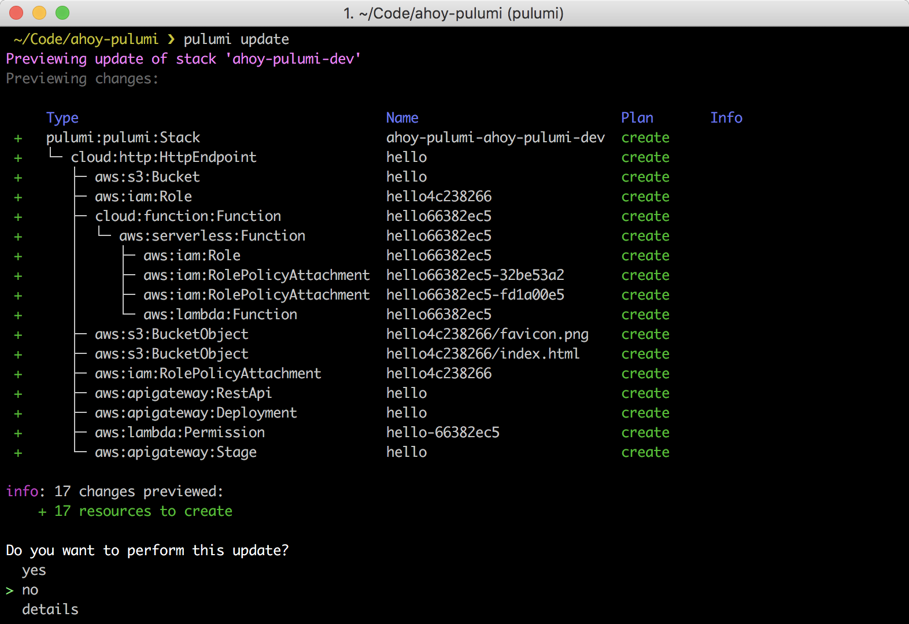
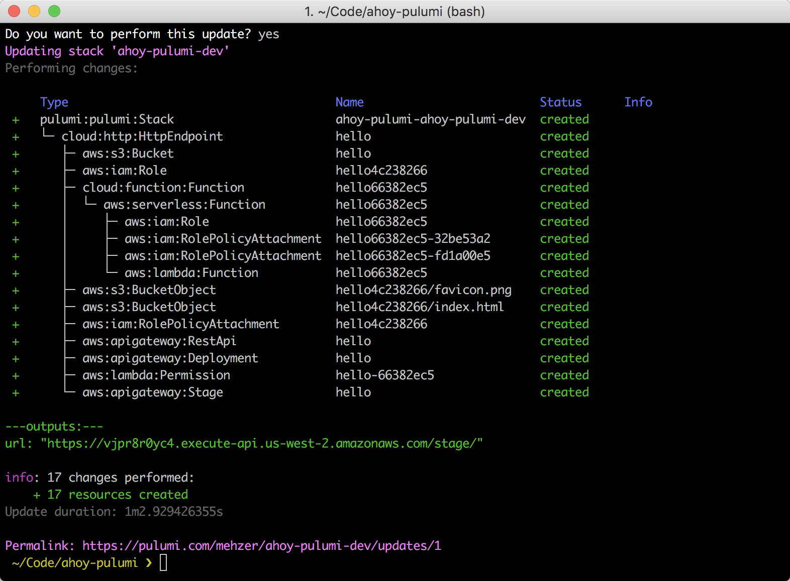
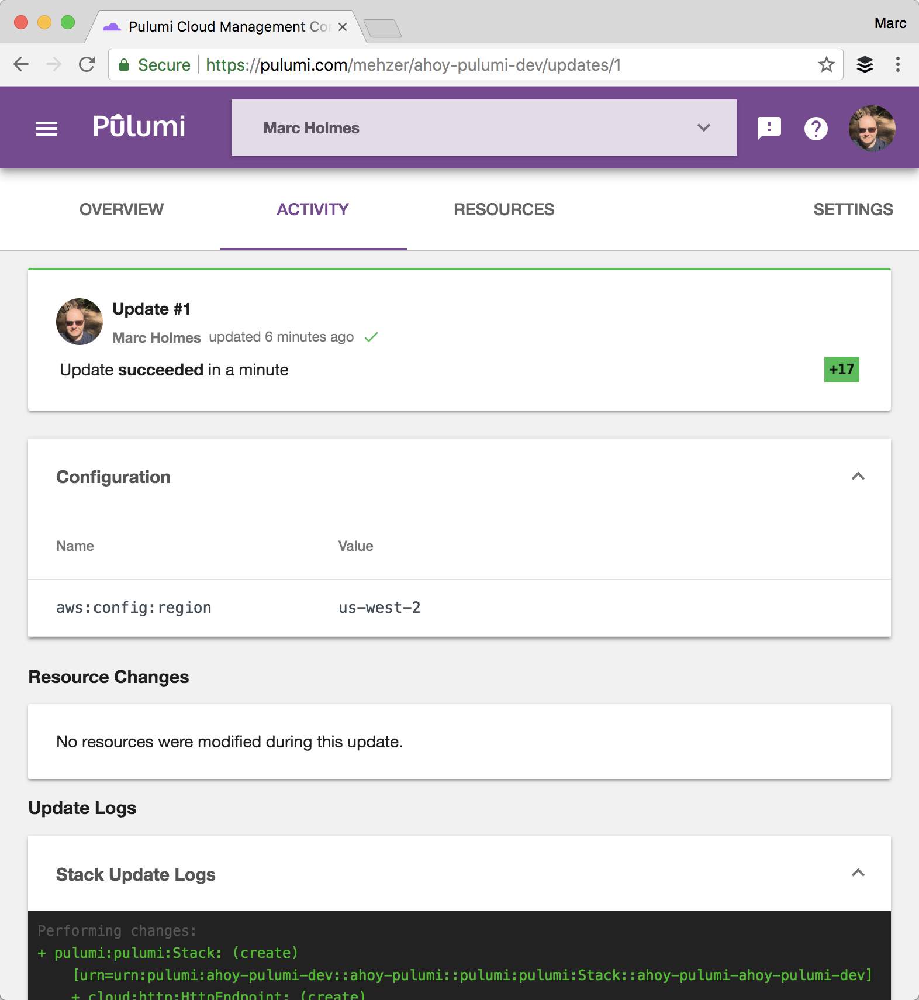
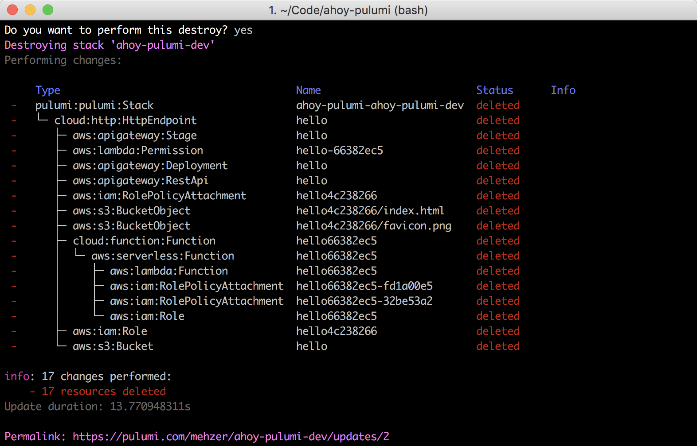

<!-- LINKS: -->
[Pulumi examples repo]: https://github.com/pulumi/examples
<!-- END LINKS: -->

In this quickstart, we'll use Pulumi to create a serverless SPA that uses a AWS Lambda to change the content that is served. We'll do this with 5 lines of JavaScript, a few lines of configuration, and whatever static content we wish to serve (in this case, a simple HTML page and a favicon).

## Pulumi helps you get code to the cloud. Together. Faster.

Pulumi is a set of tools and services to help development and DevOps teams define, deploy, and manage cloud native infrastructure. 

Pulumi enables teams to define cloud native infrastructure in familiar languages (e.g. JavaScript, Python). So, you can be more productive and take advantage of your existing skills, rather than learn a new DSL.

Pulumi enables teams to deploy cloud stacks to any cloud. It has high-level, cloud agnostic capabilities to "write once, run anywhere," but also has low-level, cloud-specific capabilities for full control of a chosen cloud stack.

Pulumi enables teams to manage cloud native infrastructure with familiar code management and application lifecycle techniques. So, cloud native infrastructure defined in Pulumi can easily be incorporated into existing development and DevOps software delivery processes.

## What we'll do

- Install and configure Pulumi.
- **Initialize** a new Pulumi project.
- **Define** our stack in JavaScript.
- **Deploy** our stack to AWS.
- **Manage** our stack in the Pulumi dashboard.
- Tear it down.

## First time using Pulumi?

If so, then you need to install the CLI, and configure AWS and NPM. 

### Install Pulumi

On Mac or Linux, run the following command:

```
curl -fsSL https://get.pulumi.com | sh
```

On Windows, [follow these install instructions](../install#windows).

### ⚠️ Prerequisites: configure AWS credentials

Pulumi deploys to your AWS account, so [make sure you have configured the AWS CLI](../install/aws.html).

## Initialize the project

Create a new folder:

```
mkdir ahoy-pulumi && cd ahoy-pulumi
```

Now, let's use the Pulumi CLI to initialize a new project:

```
pulumi new hello-aws-javascript
```

You can accept the defaults for this command. For instance, you can change the AWS region to `us-west-2`.

{:width="700px"}

After some dependency installations from NPM, you'll see a few files have been generated from this initialization process. 

{:width="700px"}

Let's look at some of those.

- `Pulumi.yaml` defines the [project](../concepts/project.html).
- `Pulumi.ahoy-pulumi-dev.yaml` is the [configuration file](../tour/basics-configuring.html) for the stack we initialized.
- `www` contains our sample static content.
- The key file for defining our stack resources `index.js` so let's examine that.

## Define stack resources

Normally, we'd write some code to define resources for our cloud stack, but in the quickstart this work is done for us. This is the content of `index.js`:

```javascript
// Import the @pulumi/cloud-aws package
const cloud = require("@pulumi/cloud-aws");
    
// Create a public HTTP endpoint (using AWS APIGateway)
const endpoint = new cloud.HttpEndpoint("hello");
    
// Serve static files from the `www` folder (using AWS S3)
endpoint.static("/", "www");
    
// Serve a simple REST API on `GET /name` (using AWS Lambda)
endpoint.get("/source", (req, res) => res.json({name: "AWS"}))
    
// Export the public URL for the HTTP service
exports.url = endpoint.publish().url;
```

See the [reference documentation](../reference/index.html) for details on the APIs we're using.

## Deploy the stack

The stack is ready to deploy, which is done as follows:

```bash
pulumi update
```

This command instructs Pulumi to determine the resources needed to create the stack. First, a preview is shown of the changes that will be made:

{:width="700px"}

Choosing `yes` will create resources in AWS. This may take a minute or two.

{:width="700px"}

Since there was a stack export (via `exports.url` in the code), this is printed in the output of `pulumi update`. We can easily `curl` this URL via `pulumi stack output`:

```bash
curl $(pulumi stack output url)
```

For a more interesting view that shows the result of calling a Lambda function, open the page in a browser:

{:width="600px"}

## Manage the stack

Our output also contained a permalink to the Pulumi dashboard. We can review the stack in the UI, and examine logs and resource usage, along with inviting friends and co-workers to collaborate on stacks. 

{:width="600px"}

## Tear Down

To destroy resources, run the following:

```bash
pulumi destroy
```

Once confirmed, Pulumi will remove all of the resources you've created. The stack itself is preserved in the Pulumi dashboard and is ready to go again as needed.

{:width="700px"}

## Recap

In this example we've seen:

- How Pulumi makes the definition of cloud resources and stacks a highly productive, code-driven activity.
- How the Pulumi CLI can initialize, configure, deploy, and manage cloud stacks.
- How the Pulumi dashboard can log, monitor, and manage information about a cloud stack.

## Next Steps

From here, you can dive deeper:

- Take a tour of the [core concepts of Pulumi](../concepts/index.html).
- Try out more quickstarts including:
  - [Create a serverless REST API](./aws-rest-api.html)
  - [Host a static site on S3](./aws-s3-website.html)
  - [Create EC2 instances on AWS](./aws-ec2.html)
- View the [JavaScript API reference](../reference/).

## More Examples

We have a number of code examples available in the [Pulumi examples repo] on GitHub. If you don't have access to the GitHub repo, please email [support@pulumi.com](mailto:support@pulumi.com) to get access, or download the [Pulumi examples zipfile](/examples/pulumi-examples.zip).

To learn more, check out the [featured example list](./examples.html).
